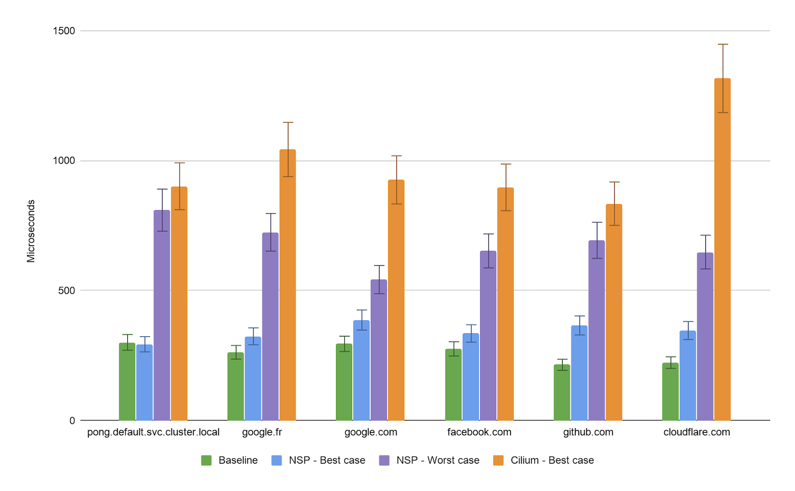
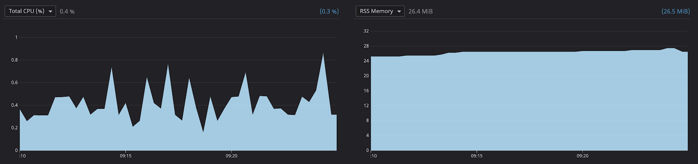

# Network Security Probe

As application security engineers, we are always looking for new ways of securing our services and reducing their privileges to only what they absolutely need. When it comes to networking, cutting egress to the world and reducing internal access on a per service basis have always been two of the top priorities. However, as cloud computing services and container-orchestration systems (like Kubernetes) spread, static IP based solutions are becoming obsolete.

With the spread of container orchestration technologies like Kubernetes, deploying microservices has never been easier. Although Kubernetes introduced a DevOps breakthrough, it also introduced a new security concern: services that used to be hosted on isolated machines, can now run side by side in containers, sharing the same kernel and other host level resources. This means that any host level access control will have a hard time differentiating one service from another without any control at the Kubernetes level.

Network Security Probe provides a solution to this limitation and focuses on using eBPF to perform process level network security monitoring and enforcement. Although multiple tools already leverage eBPF to monitor and enforce networking rules (such as [Cilium](https://docs.cilium.io) in Kubernetes), most of them only apply those rules at the interface level. By introducing a more fine-grained solution, malicious network activity can be mapped back to specific processes. This drastically improves investigation efforts, refines enforcement accuracy to avoid unnecessary downtime, and paves the way to a faster incident response time.

For a more complete introduction to the project, and description of its architecture, head over to [the article published at the SSTIC 2020 conference](https://www.sstic.org/2020/presentation/process_level_network_security_monitoring_and_enforcement_with_ebpf/).

## Requirements

The project was developed on Linux ubuntu-bionic, kernel version 4.15.0.
The script `env_setup.sh` will setup a vagrant VM with the required dependencies for you (requires virtualbox & vagrant).

## Getting started

1) Vendor go dependencies. If you want to change the SecurityProfile custom resource by using `hack/update-codegen.sh`, you'll need to manually clone `https://github.com/kubernetes/code-generator` (branch `v0.17.0`) into `/vendor/code-generator`.

```
go mod vendor
```

2) Build Network Security Probe.

```
make build
```

3) (optional) Build the ping, pong and attacker containers used by the demo.

```
make demo
```

4) Network Security Probe sends alerts to [Datadog](https://www.datadoghq.com/). Fetch and export your Datadog API key.

```
export DD_API_KEY=****
```

5) Start the Datadog Agent

```
make run_agent
```

6) (optional) Start a minikube cluster, this cluster will be used for the demo.

```
sudo minikube start --vm-driver=none --kubernetes-version=1.17.0
```

7) Start Network Security Probe.

```
make run
```

8) (optional) Start the ping-pong demo.

```
sudo helm install ping-pong static/charts/ping-pong
```

9) (optional) After modifying the profiles in `static/charts/ping-pong/templates`, you can update them with

```
sudo helm upgrade ping-pong static/charts/ping-pong
```
The changes will automatically be picked up by NSP and the new profiles should be applied within seconds.

## Ping-pong demo

The Ping-pong demo contains 3 simple pods:
- a `pong` pod that contains a simple webapp listening on `0.0.0.0:80`. Its SecurityProfile is defined in `static/charts/ping-pong/templates/pong-profile.yaml`.
- a `ping` pod that periodically reaches out to the pong endpoint. Its SecurityProfile is defined in `static/charts/ping-pong/templates/ping-profile.yaml`.
- an `attacker` pod that doesn't have any profile.

You can use this simple app to block or allow the communication between the `ping` and the `pong` pods at runtime. You can also use the `attacker` pod to trigger the RCE vulnerability in the `pong` service and see what kind of logs, alerts and enforcement capabilities the project has. A full demo was recorded for the SSTIC conference, you can watch it [here](https://www.sstic.org/2020/presentation/process_level_network_security_monitoring_and_enforcement_with_ebpf/). 

## Performances and overhead

There are two kinds of overhead that one needs to assess when using an eBPF-based tool. The first overhead is the resource usage of the user space program. The more resources are allocated to our security agent, the less will be available to the services you are running in production, and therefore the slower your services will respond. The second overhead is the in-kernel overhead. In other words this is the latency introduced by the tool on each egress or ingress packet. The more logic you push in your eBPF programs, the bigger the overhead on each packet will be.

We decided to focus our benchmarking efforts on the packets that we knew had the worst overhead: the DNS request and response packets. As we parse both DNS requests and responses in the kernel to match domain names, those packets are the ones that are the most delayed. We also wanted to compare our results with Cilium which has a different strategy when it comes to DNS packets: Cilium forwards the DNS traffic to a DNS proxy and performs the assessment in user-space. So how does the project compare with a production ready solution like Cilium?


Average round trip time per domain (averaged over 5000 A record queries per domain). The test was performed on a Linux ubuntu-bionic 4.15.0-88-generic, 2 vCPUs, 8 Gb RAM. Keep in mind that Cilium has many more features than Network Security Probe, the point of the comparison is simply to assess the overhead of the project compared to a production ready solution.


CPU and RAM usage of the user-space program over time.

Although more testing would definitely be required to accurately assess the overhead in a real word environment, those results seem to confirm that there are no red flags to mapping network packets back to processes and assessing each packet at runtime. The worst case overhead is around 400 microseconds which is about half of the overhead of Cilium. This seems to confirm that in-kernel DNS parsing is a good strategy performance wise (but keep in mind that our DNS support is only partial for now, DNS parsing without loops is hard). Also, keep in mind that the 400 microseconds is the worst case scenario for the packets requiring the most processing. Our benchmark revealed that the actual overhead for a normal packet is closer to 200 microseconds for our tool and 250 microseconds for Cilium. Either way, those overheads are acceptable in a production environment.
